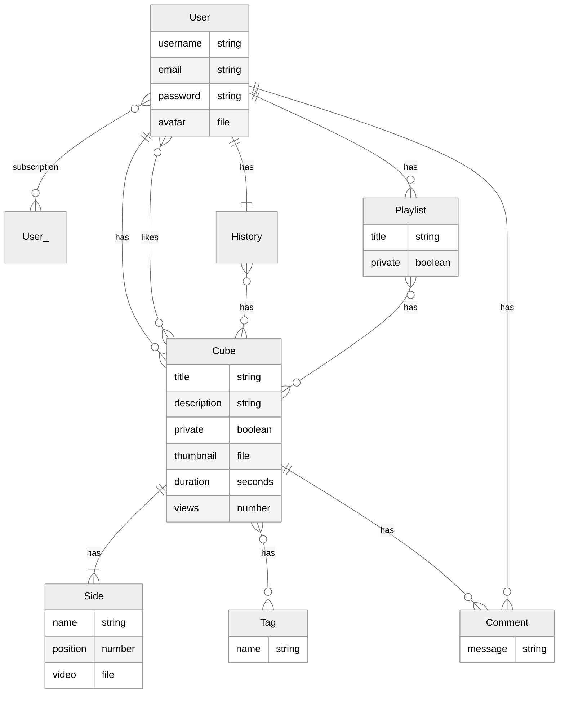

# Documentation

Specter is a video platform for multi perspective videos.
Backend and frontend are separated and interact over an API.

## Entity relationship diagram

> IDs and timestamps are implicit.
 
> The multi perspective videos are called "cubes". Each perspective is a "side".
 
## API

A RESTful API is exposed under `/api`.
All available endpoints are documented using [Insomnia](https://insomnia.rest/).

[→ insomnia.json](insomnia.json)
